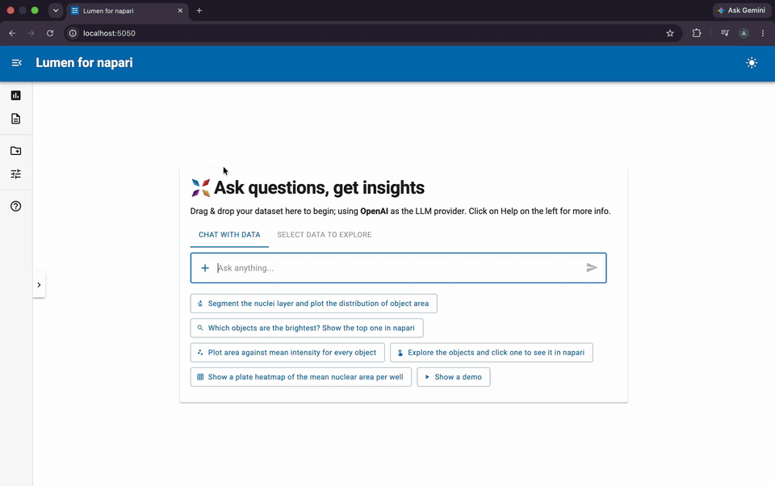
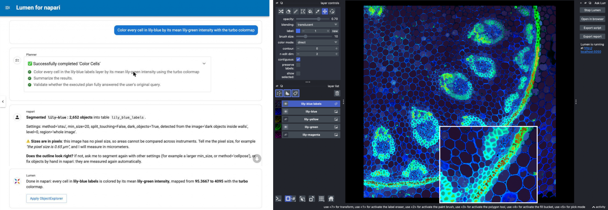
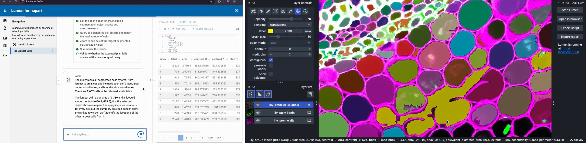

# lumen-napari

**Ask questions about your napari images in plain language.**

[Documentation](https://ghostiee-11.github.io/lumen-napari/) · [Examples](https://ghostiee-11.github.io/lumen-napari/examples/) · [Contributing](CONTRIBUTING.md)

[](https://ghostiee-11.github.io/lumen-napari/#watch-it)

*"Find every cell, tell me how many there are, and show me where the biggest ones live."*



*One question in the Lumen chat (left) segments 2,652 cells and colors each by its lignin in napari (right, zoomed inset).*



*Lumen's answer (left) and the same cell selected in napari (right): label 2508, area 3,780.*

lumen-napari connects [napari](https://napari.org) to [Lumen](https://lumen.holoviz.org), the HoloViz AI data explorer. Ask "how many cells are there, and are the lignified ones smaller?" and it segments the image open in napari, measures every object into a table, and answers with statistics and charts. Click a point on a chart and napari zooms to that cell.

## What it does

- **Upload or open any image**: PNG, TIFF, OME-TIFF, OME-Zarr, CZI, ND2, LIF, color or multichannel, 2D or 3D, small or whole-slide.
- **Segments by itself**: it detects bright objects, dark objects on a bright background, or cells inside walls and membranes, and picks Otsu or Cellpose (for stained tissue) on its own, telling you why.
- **Measures every object** in physical units: size, shape, intensity in every channel and color.
- **Answers questions** with SQL, statistics and charts, including plate heatmaps and dose-response fits with wells as replicates.
- **Clicks back to the pixels**: charts, tables and plate wells zoom napari to the object behind them.
- **Acts on napari**: show an object, color objects by any measurement, hide the ones that do not match.
- **Keeps up with your edits**: paint or erase labels by hand and the tables update.
- **Shows its work**: every step posts its settings and the outlines on the image, and you can export a Python script that reruns the analysis and an HTML report to share.

## Install

```bash
pip install "lumen-napari[qt] @ git+https://github.com/ghostiee-11/lumen-napari.git"
```

Add `[cellpose]` for stained tissue and crowded cells, and `[bioio]` for OME-TIFF and OME-Zarr metadata. lumen-napari currently tracks the `main` branches of Lumen and napari.

Lumen needs a language model: an API key from a provider it supports, a local model, or a coding assistant you are already signed in to. See [Choosing an LLM](https://ghostiee-11.github.io/lumen-napari/getting_started/llm/).

## Use

1. Start napari and open an image, or try **File > Open Sample > Lumen > Lily stem cells (4 channels)**.
2. Open **Plugins > Ask Lumen** and click **Start Lumen**. The chat opens in your browser.
3. Ask, for example:
   - "How many cells are there? Plot the distribution of their size."
   - "Color every cell by its mean lily-green intensity"
   - "Show me the largest cell"
   - "Explore the objects", then click a point
   - "Segment every image in ~/plate1 with the plate map ~/plate1_map.csv. Which compounds shrink nuclei compared to DMSO?"

You can also drop image files straight into the chat. The chat server listens only on your own machine and stops when napari closes.

## Learn more

The [documentation](https://ghostiee-11.github.io/lumen-napari/) has a quickstart, how-to guides for every workflow (plates, statistics, large images, regions, exports), reference pages for every chat action and measurement, and notes on how it works and where it stops working.

## License

BSD 3-Clause
