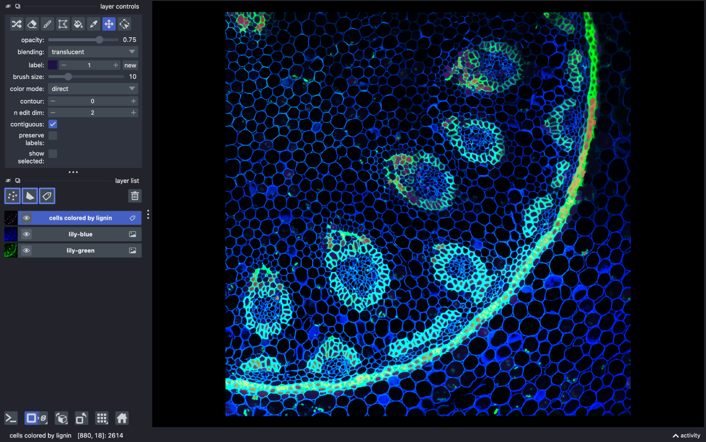
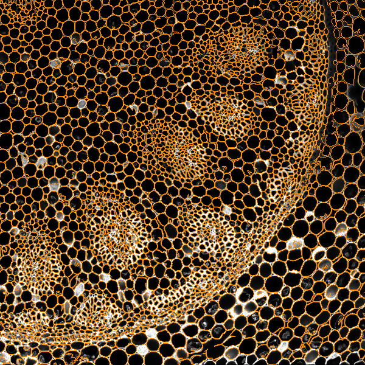
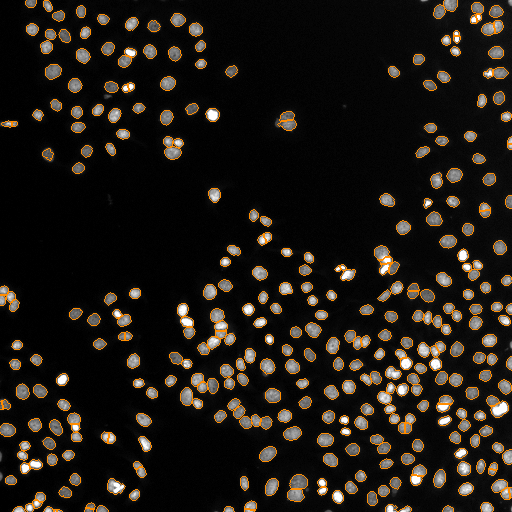
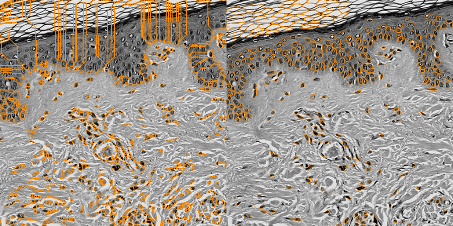

# Examples

Four datasets, from plant tissue to galaxies, each with the questions to ask and the numbers lumen-napari gives on them. Every number on this page was measured with the current version; the drug screen has a known answer, the others are checked by eye on the outline images.

## Plant stem: cells inside walls

A confocal section of a lily-of-the-valley stem (scikit-image's `lily`). Open it with **File > Open Sample > Lumen > Lily stem cells (4 channels)**: `lily-blue` shows every cell wall, `lily-green` the lignified walls of the vascular bundles.

Here the cells are the dark spaces between bright walls. lumen-napari detects that by itself: it finds the dark cells, with a local threshold so faint walls still separate them, and leaves out the background regions at the edge of the image.

> How many cells are in lily-blue?

> Color every cell by its mean lily-green intensity

> Are the lignified cells smaller than the rest? Show me with a chart.

> Plot every cell at its position, sized by area and colored by lignin

About 2,650 cells. The 20% most lignified cells have a median area of 54 pixels against 123 for the rest: vascular cells are about 2.3 times smaller.

## Nuclei: counting and measuring

HeLa cell nuclei (scikit-image's `human_mitosis`, **File > Open Sample > Lumen > HeLa nuclei (2D)**).

> How many nuclei are there and how big are they?

> The pixel size is 0.65 µm

> Show me the largest nucleus

> Explore the objects

About 350 nuclei. Click a point in the explorer to zoom napari to that nucleus.

## A drug screen: wells, compounds and doses

A 32-well screen with a plate map of compounds and doses, one OME-TIFF per well with its pixel size. See [Screens and plates](how_to/plates.md) for the folder and plate map format.

> Segment every image in ~/screen with pattern *.ome.tiff and the plate map ~/plate_map.csv

> Show a plate heatmap of the median nuclear area per well

> Which compounds change nuclear area compared to DMSO? Fit a dose-response on dose_uM.

On a simulated screen built from real HeLa nuclei, with a known answer (taxol EC50 0.1 µM, nocodazole 1 µM, aspirin no effect), lumen-napari finds taxol 1.8 times larger (p = 0.004, EC50 0.105 µM), nocodazole 1.3 times (p = 0.03, EC50 1.05 µM) and no effect and no EC50 for aspirin (p = 0.78). Wells are the replicates; see [Compare conditions](how_to/statistics.md).

## Stained tissue: why the method matters

On H&E-stained skin a threshold (left) cuts the tissue into fragments; Cellpose (right) finds each nucleus. With the `[cellpose]` extra installed, lumen-napari switches to Cellpose for stained tissue and brightfield by itself and says why. See [Segment and measure](how_to/segment.md#choose-a-method).

## Beyond biology: galaxies

The Hubble Deep Field (scikit-image's `hubble_deep_field`) works the same way: drop the image in the chat.

> How many objects are in this image? Show me the biggest one.

> Which are the reddest? Color them by redness.

> Plot size against brightness on log axes

About 435 bright objects. Color images keep their colors and every object gets `intensity_mean_red`, `_green` and `_blue`. Some of the smallest objects are stars or noise: hide them with a size filter.
